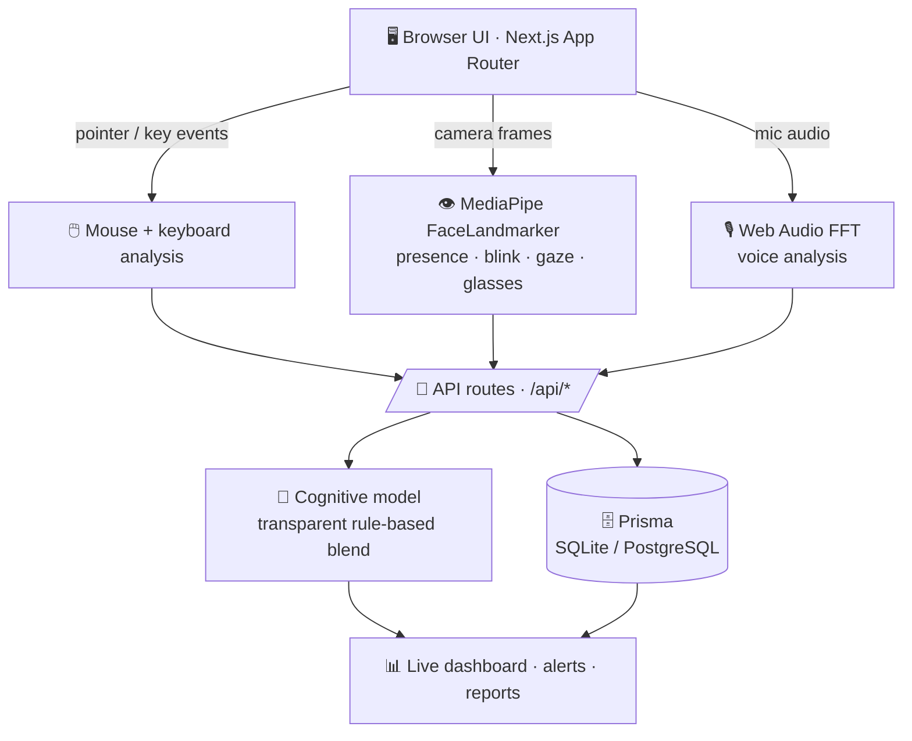

<div align="center">

# 🧠 NEUROSHADOW

### AI Cognitive‑State Dashboard — real on‑device sensing, honest about what it measures

*Your mouse, eyes, face & voice analyzed live in the browser — turned into explainable **focus**, **load**, **fatigue**, **stress** & **collapse‑risk** indicators. Nothing leaves your device.*

<br/>


<br/>


<br/>

**[✨ Highlights](#-highlights) · [🧪 Real vs. Derived](#-whats-real-vs-derived) · [🚀 Quick Start](#-quick-start) · [🏗️ Architecture](#%EF%B8%8F-architecture) · [📡 API](#-api-reference) · [🔒 Privacy](#-privacy--security) · [🗺️ Roadmap](#%EF%B8%8F-roadmap)**

</div>

---

> [!IMPORTANT]
> NEUROSHADOW is an **educational & research demonstration**. The **sensor analysis is real**, but the cognitive interpretation is a **transparent, non‑validated rule‑based model** — it is **not** medical diagnosis, treatment, or advice.

---

## ✨ Highlights

| | |
|---|---|
| 👁️ **Real on‑device face & eye AI** | MediaPipe FaceLandmarker detects **face presence, blink, gaze, head pose** — and even estimates **glasses**. Walk out of frame and confidence honestly drops to 0. |
| 🖱️ **Real behavioral sensing** | Live mouse + keyboard‑rate analysis: velocity, jitter, idle, direction changes, actions/min. |
| 🎙️ **Real voice analysis** | Web Audio FFT for volume, clarity, stability, tone — fully local. |
| 🧮 **Explainable indicators** | Focus, cognitive load, fatigue, stress, stability & collapse‑risk, each citing the sensors that produced it. |
| 🛰️ **Background‑aware** | Camera + mic keep analyzing across tabs; the UI is honest about the browser limits on keyboard/mouse. |
| 🌍 **Bilingual + RTL** | Full English 🇬🇧 / Persian 🇮🇷 UI with right‑to‑left layout. |
| 🔐 **Privacy‑first** | Raw frames, audio & coordinates **never leave the browser** — only aggregates are stored. |
| 🧰 **Runs anywhere** | SQLite demo fallback or PostgreSQL production — **no paid API keys**. |

---

## 🧪 What's real vs. derived

Honesty is the whole point — here is exactly what each number is:

| Signal | Status | How it's produced |
|---|:---:|---|
| 🖱️ Mouse & keyboard rate | ✅ **Real** | Browser pointer/key events → velocity, jitter, idle, actions/min |
| 👁️ Face & eye | ✅ **Real (on‑device AI)** | MediaPipe FaceLandmarker → presence, blink, gaze, head pose, glasses estimate |
| 🎙️ Voice | ✅ **Real** | Web Audio FFT → volume, clarity, stability, tone variability |
| 🧠 Focus / load / fatigue / stress / collapse‑risk | ⚖️ **Derived** | Transparent rule‑based blend of the real sensors — **not** validated science |
| 🔢 No‑signal state | 🚫 **Honest blank** | When no sensor is live, the board shows *"awaiting signal"* — never fabricated numbers |

> [!NOTE]
> 🕶️ **Glasses detection is a heuristic** (edge + reflection analysis of the eye region), not a trained classifier — great for *"likely wearing glasses,"* not a guarantee.

---

## 🏗️ Architecture



```text
src/
├─ app/
│  ├─ page.tsx              Auth-aware entry redirect
│  ├─ login · register      Auth pages
│  ├─ dashboard · panel     Protected routes
│  └─ api/*/route.ts        Backend API routes
├─ components/*             Reusable UI (metric cards, brain map, live monitor…)
├─ lib/
│  ├─ faceLandmarkerClient  On-device MediaPipe loader  ✨ new
│  ├─ eyeVisionFrame        Landmarks → blink/gaze/head/glasses-ROI  ✨ new
│  ├─ eyeAnalysis           Real eye aggregation + glasses estimate  ✨ new
│  ├─ mouseAnalysis · voiceAnalysis   Real behavioral/audio sensing
│  ├─ cognitiveModel        Transparent sensor → indicators blend
│  └─ prisma · validation · security · reportGenerator
└─ prisma/schema.prisma     14 data models
```

If Prisma can't connect, the app keeps running in **demo mode** and says so — reliable for live judging and offline rehearsals.

---

## 🚀 Quick Start

```bash
# 1 · clone & install
git clone https://github.com/mhmdevan/NEUROSHADOW.git
cd NEUROSHADOW
pnpm install

# 2 · configure (SQLite demo works out of the box)
cp .env.example .env

# 3 · database + run
pnpm prisma:generate
pnpm prisma:migrate
pnpm dev
```

Open 👉 **http://localhost:3030**

> [!TIP]
> Go to **Live Input → Start eye analysis**, allow the camera, then **walk out of frame** — watch the badge flip to red and confidence fall to 0. Put on glasses and watch the **Glasses** readout change. *(First run downloads a ~3 MB on‑device model; if it can't, the app says so instead of faking it.)*

---

## 🧰 Tech Stack

| Layer | Tools |
|---|---|
| **Framework** | Next.js 16 (App Router) · React 19 · TypeScript 5.8 |
| **On‑device AI** | `@mediapipe/tasks-vision` FaceLandmarker (WASM + WebGL) |
| **Sensing** | Pointer/Key events · Web Audio API · Canvas image analysis |
| **Data** | Prisma 6 · SQLite (demo) · PostgreSQL (production) |
| **UI / Motion** | CSS + SVG neural field · Framer Motion · lucide icons · visx |
| **Validation** | Zod 4 |
| **Testing** | Vitest 3 · Testing Library |
| **Tooling** | pnpm 10 · ESLint |

---

## 📡 API Reference

<details>
<summary><b>🔐 Auth & user routes</b></summary>

| Route | Purpose |
|---|---|
| `POST /api/auth/register` | Create user, hash password (scrypt), set HttpOnly session |
| `POST /api/auth/login` | Verify credentials, start session |
| `POST /api/auth/logout` | Clear server session + cookie |
| `GET /api/auth/me` | Current signed‑in user |
| `GET /api/auth/csrf` | Ensure readable CSRF cookie for client mutations |
| `GET /api/user/overview` | User‑scoped counts + recent reports |
| `GET /api/user/export` | Export the user's own data as JSON |
| `DELETE /api/user/session` | Delete current session records |
| `DELETE /api/user/all-data` | Delete account‑owned records + clear session |

Authenticated mutations require the `neuroshadow_csrf` cookie + `x-neuroshadow-csrf` header (sent automatically via `secureFetch`) and pass through in‑memory rate limiting.

</details>

<details>
<summary><b>📊 Metrics, sensors & analysis</b></summary>

| Route | Purpose |
|---|---|
| `GET /api/health` | Service status, DB mode, recent API errors |
| `GET /api/metrics` | Sensor‑derived cognitive metrics (or honest no‑signal) |
| `GET /api/alerts` · `GET /api/logs` | Live alerts & AI engine logs |
| `POST /api/mouse-analysis` | Store aggregate mouse indicators (no raw coordinates) |
| `POST /api/eye-analysis` | Store aggregate eye indicators (no camera frames) |
| `POST /api/voice-analysis` | Store aggregate voice indicators (no raw audio) |
| `POST /api/report` | Generate explainable, non‑medical report |

Example — `POST /api/eye-analysis` (aggregates only):

```json
{
  "trackingQuality": 82, "gazeStability": 76, "blinkProxy": 12,
  "lightingQuality": 88, "motionVariance": 16, "focusConsistency": 79,
  "confidence": 84, "frameCount": 24, "faceDetected": true,
  "facePresence": 100, "glassesConfidence": 71, "glassesDetected": true
}
```

</details>

<details>
<summary><b>🎯 Baseline, reviews, actions & trends</b></summary>

| Route | Purpose |
|---|---|
| `POST /api/baseline/start` · `POST /api/baseline/complete` · `GET /api/baseline/current` | Personal baseline flow with self‑check‑in + sensor capture |
| `GET` / `POST /api/session-review` | Summarize strongest change, best/weakest window, next action |
| `POST /api/actions/recommend` | One explainable, non‑medical productivity action |
| `POST /api/actions/feedback` · `GET` / `POST /api/actions/follow-up` | Accept/dismiss + "did it help?" loop |
| `GET /api/trends/weekly` | 7‑day reflection: focus, stability, sessions, top alert & action |
| `POST /api/feedback` | Validated feedback (name, email, message, rating 1–5) |

</details>

---

## 🔒 Privacy & Security

- 🧠 **Local‑only sensing** — camera frames, microphone audio & raw pointer coordinates are processed in the browser and **never sent to the server**. Only derived aggregates are stored.
- 🔑 **Auth** — passwords hashed with `scrypt`, server‑side session records, HttpOnly cookies.
- 🛡️ **CSRF + rate limiting** on authenticated mutations; cookie hardening via `NEUROSHADOW_SECURE_COOKIES` / `NEUROSHADOW_COOKIE_SAMESITE`.
- 🧹 **Safe rendering** — text sanitized, rendered as text (no unsafe HTML); responses send `X-Content-Type-Options: nosniff` and disable caching.
- 👤 **User‑scoped data** — snapshots, reports, feedback & audit logs are tied to the authenticated user.

> [!WARNING]
> Capturing keyboard/mouse from **other apps or tabs is impossible for a web page** (browser security). Only camera + mic continue in the background. True system‑wide capture needs a desktop app — the full plan is in **[BACKGROUND_MONITORING.md](BACKGROUND_MONITORING.md)**.

---

## 🌍 Language Support

Full **English 🇬🇧 / Persian 🇮🇷** switching from the top bar — localized dashboard copy, reports, validation messages, alerts, logs, and an RTL‑aware (`dir="rtl"`) layout.

---

## ⚙️ Scripts

| Command | Does |
|---|---|
| `pnpm dev` | Start dev server on **:3030** |
| `pnpm build` · `pnpm start` | Production build / serve |
| `pnpm test` | Run Vitest suite (59 tests) |
| `pnpm lint` | ESLint (zero‑warning policy) |
| `pnpm prisma:migrate` · `pnpm prisma:studio` | Migrate / inspect the database |
| `pnpm prisma:generate:postgres` · `pnpm prisma:push:postgres` | PostgreSQL production schema |

Full production walkthrough → **[DEPLOYMENT.md](DEPLOYMENT.md)**

---

## 🗺️ Roadmap

- [x] Real on‑device face/eye detection (MediaPipe) with glasses estimate
- [x] Background‑aware camera + mic analysis
- [x] Honest "no signal" + face‑presence states
- [ ] Persist `faceDetected` / `glasses` to the database (one migration)
- [ ] Move the detector into a Web Worker for steadier background throughput
- [ ] Optional trained glasses classifier for higher accuracy
- [ ] Transparent ML models trained on consented datasets + model cards
- [ ] Teams, study management & report export history

<details>
<summary><b>🎤 How to present to judges</b></summary>

1. Open the dashboard; note the data is **real on‑device sensing** but the interpretation is **non‑medical**.
2. Show live metric cards, brain map, prediction gauge, timeline, alerts & logs.
3. Run the **personal baseline** scan → quality score + current‑vs‑baseline.
4. Generate an **action recommendation**, show the reason, accept / mark not useful.
5. Show the **follow‑up** panel and **weekly trends**.
6. Move the mouse → watch the **real mouse‑analysis** panel update.
7. **Start eye analysis** → step out of frame (confidence → 0), put on glasses (readout changes).
8. **Start voice analysis** → speak and watch aggregates update.
9. Submit **feedback** to demonstrate backend validation.
10. Hit `/api/health`, `/api/metrics`, `/api/eye-analysis`… to show real routes.
11. Explain the Prisma schema and SQLite → PostgreSQL path.

</details>

---

## 📄 Disclaimer

NEUROSHADOW is an **educational and research demonstration**. It analyzes real browser‑derived signals but produces a transparent, non‑validated interpretation. It does **not** provide medical diagnosis, treatment, or health recommendations. Real cognitive or biometric use would require explicit consent, retention limits, access controls, and privacy review.

<div align="center">

<br/>

**Built with 🧠 + ☕ · If this project sparks your curiosity, drop it a ⭐**


</div>
